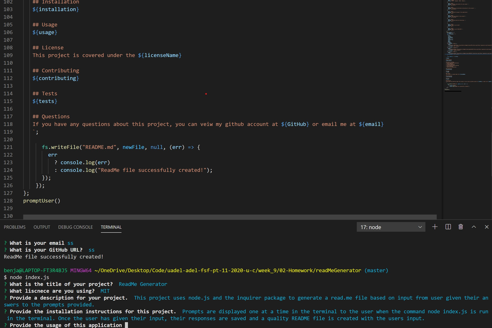

# ReadMe Generator

   [](https://opensource.org/licenses/MIT)
    
   ## Description
   This project uses node.js and the inquirer package to generate a read.me file based on input from user given their answers to the prompts provided.    
  
   ## Table Of Contents
   * [Installation](##Installation)
   * [Usage](##Usage)
   * [License](##License)
   * [Contributing](##Contributing)
   * [Tests](##Tests)
   * [Questions](##Questions)
  
   ## Installation
   Prompts are displayed one at a time in the terminal to the user when the command node index.js is run in the terminal. Once the user has given their input, their responses are saved and a quality README file is created with the users input included.
  
   ## Usage
   
   The above image shows an exmaple of the code generated and the command line example.
   
   [link to example vid](https://drive.google.com/file/d/1aQGTAFTtEs0Dshr0jKyaXYu0ogfcjNdz/view?usp=sharing)

   ## License
   This project is covered under the MIT License  
      
   ## Contributing
      [bencyna](https://github.com/bencyna/)
  
   ## Tests
   Run the following command into the root directory: ```node index.js```
  
   ## Questions
   If you have any questions about this project, you can veiw my github account at https://github.com/bencyna or email me at benjamincyna@gmail.com
   